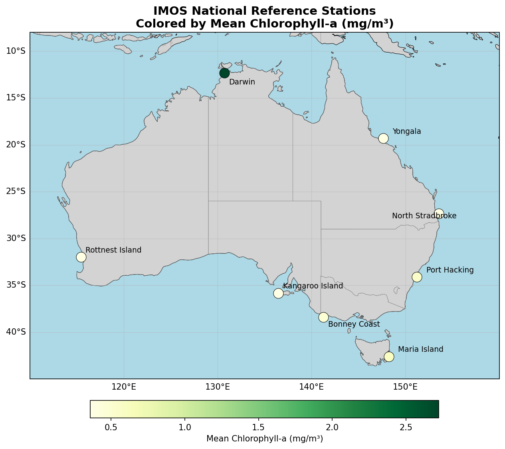
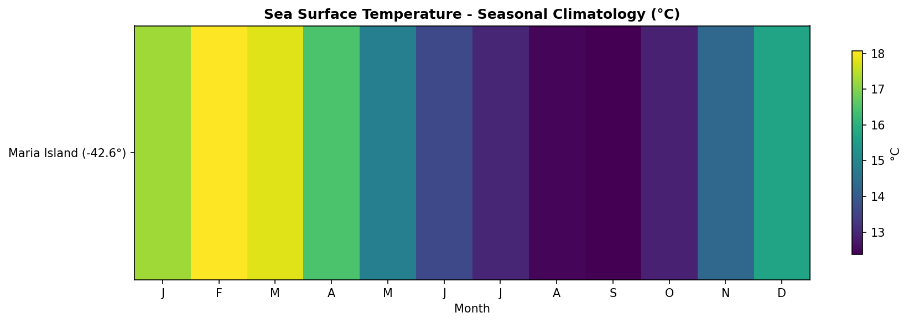
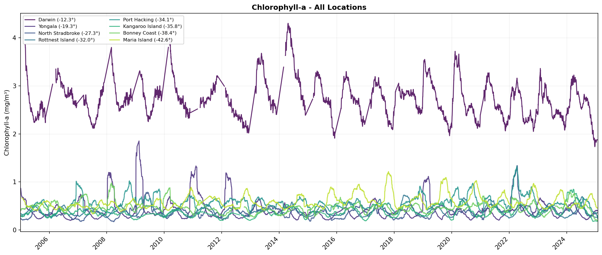

# IMOS Reference Mooring Satellite Ocean Data Downloader

Automated extraction of satellite-derived ocean variables for the 8 Australian IMOS National Reference Stations, spanning 2005-2025.

## Overview

This toolkit extracts time series of key oceanographic variables at specific lat/lon coordinates from global satellite and reanalysis products. Variables include:

| Variable | Source | Resolution | Coverage |
|----------|--------|------------|----------|
| **SST** (Sea Surface Temperature) | NOAA OISST v2.1 | 0.25°, daily | 1981-present |
| **Chlorophyll-a** | ESA OC-CCI v6.0 | 4 km, daily | 1997-present |
| **NPP** (Net Primary Production) | MODIS VGPM | 4 km, 8-day | 2003-present |
| **Wind** (10m speed & direction) | ERA5 Reanalysis | 0.25°, daily | 1940-present |
| **MLD** (Mixed Layer Depth) | HYCOM GLBy0.08 | 0.08°, daily | 2018-present |

**Locations:** 8 IMOS National Reference Stations around Australia:

| Station | Latitude | Longitude | Region |
|---------|----------|-----------|--------|
| Darwin | -12.34° | 130.70° | Northern Territory |
| Yongala | -19.31° | 147.62° | Queensland (GBR) |
| North Stradbroke | -27.34° | 153.56° | Queensland |
| Rottnest Island | -31.99° | 115.42° | Western Australia |
| Port Hacking | -34.12° | 151.22° | NSW |
| Kangaroo Island | -35.83° | 136.45° | South Australia |
| Bonney Coast | -38.41° | 141.27° | Victoria |
| Maria Island | -42.60° | 148.23° | Tasmania |



Data is accessed via THREDDS/OPeNDAP/ERDDAP APIs - no bulk downloads required. Scripts are resume-friendly and save incrementally.

## Example Outputs





Data Download Scripts Provided by Dr N. A. Pittman (Emmi), and the joys of Open Science. PRs welcome!

**Code License:** CC0 - public domain, no restrictions.

## Usage

```bash
# Download individual variables
python download_sst.py
python download_chl.py
python download_npp.py
python download_wind_era5_0.25deg.py
python download_mld.py

# Generate plots from downloaded data
python plot_timeseries.py

# Download all + generate plots
python download_all.py # (Might wanna paralellise this)
```

## Output Structure

```
data/
  maria_island/
    sst_daily_0.25deg.csv
    chl_daily_4km.csv
    npp_8day_4km.csv
    wind_era5_daily_0.25deg.csv
    mld_daily_0.08deg.csv
  port_hacking/
    ...

charts/
  maria_island/
    overview.png       # All variables combined
    seasonal.png       # Monthly climatology
    sst.png           # Individual variable plots
    chl.png
    ...
  port_hacking/
    ...
```

## Configuration

Edit `config.py` to modify:
- `START`, `END`: Time range (default: 2005-2025)
- `LOCATIONS`: List of (name, lat, lon) tuples - add your own locations here
- `NPP_RESOLUTION`: "8day" (default, reliable) or "daily" (may be slow)

---

## Datasets

### SST - Sea Surface Temperature

| Property | Value |
|----------|-------|
| Source | NOAA OISST v2.1 |
| Spatial Resolution | 0.25° (~25 km) |
| Temporal Resolution | Daily |
| Coverage | 1981-present, global |
| Access | ERDDAP HTTP download |

**Description:**
Optimum Interpolation Sea Surface Temperature (OISST) is a gap-free SST product combining satellite (AVHRR) and in-situ observations using optimal interpolation.

**Citation:**
Huang, B., C. Liu, V. Banzon, E. Freeman, G. Graham, B. Hankins, T. Smith, and H.-M. Zhang, 2021: Improvements of the Daily Optimum Interpolation Sea Surface Temperature (DOISST) Version 2.1. *Journal of Climate*, 34, 2923-2939. https://doi.org/10.1175/JCLI-D-20-0166.1

**URL:** https://coastwatch.pfeg.noaa.gov/erddap/griddap/ncdcOisst21Agg_LonPM180

---

### CHL - Chlorophyll-a

| Property | Value |
|----------|-------|
| Source | ESA Ocean Colour CCI v6.0 |
| Spatial Resolution | 4 km |
| Temporal Resolution | Daily |
| Coverage | 1997-present, global |
| Access | OPeNDAP (THREDDS) |

**Description:**
Multi-sensor merged chlorophyll-a product combining SeaWiFS, MODIS-Aqua, MERIS, VIIRS, and OLCI (Sentinel-3). Uses band-shifting and bias correction to create consistent long-term climate data record.

**Citation:**
Sathyendranath, S., et al., 2019: An Ocean-Colour Time Series for Use in Climate Studies: The Experience of the Ocean-Colour Climate Change Initiative (OC-CCI). *Sensors*, 19, 4285. https://doi.org/10.3390/s19194285

**URL:** https://rsg.pml.ac.uk/thredds/dodsC/CCI_ALL-v6.0-DAILY

**DOI:** https://doi.org/10.5285/9c334fbe6d424a708cf3c4cf0c6a53f5

---

### NPP - Net Primary Production

| Property | Value |
|----------|-------|
| Source | MODIS Aqua (VGPM algorithm) |
| Spatial Resolution | 4 km |
| Temporal Resolution | 8-day composite |
| Coverage | 2003-present, global |
| Access | OPeNDAP (ERDDAP) |

**Description:**
Vertically Generalized Production Model (VGPM) estimates of net primary production derived from MODIS chlorophyll, SST, and PAR. Units: mg C m⁻² day⁻¹.

**Citation:**
Behrenfeld, M.J. and P.G. Falkowski, 1997: Photosynthetic rates derived from satellite-based chlorophyll concentration. *Limnology and Oceanography*, 42(1), 1-20. https://doi.org/10.4319/lo.1997.42.1.0001

**URL:** https://coastwatch.pfeg.noaa.gov/erddap/griddap/erdMH1pp1day

---

### Wind - 10m Wind Speed & Direction

| Property | Value |
|----------|-------|
| Source | NCEP/NCAR Reanalysis 1 |
| Spatial Resolution | ~2° (T62 Gaussian grid) |
| Temporal Resolution | Daily (from 6-hourly) |
| Coverage | 1948-present, global |
| Access | OPeNDAP (THREDDS) |

**Description:**
NCEP/NCAR Reanalysis 1 provides 10m u-wind and v-wind components. Wind speed and direction computed as:
- Speed = √(u² + v²)
- Direction = (270 - atan2(v, u)) mod 360 (meteorological convention: direction wind is coming FROM)

**Citation:**
Kalnay, E., et al., 1996: The NCEP/NCAR 40-Year Reanalysis Project. *Bulletin of the American Meteorological Society*, 77, 437-472. https://doi.org/10.1175/1520-0477(1996)077<0437:TNYRP>2.0.CO;2

**URL:** https://psl.noaa.gov/thredds/dodsC/Datasets/ncep.reanalysis/surface_gauss/

---

### Wind (ERA5) - Higher Resolution Alternative

| Property | Value |
|----------|-------|
| Source | ECMWF ERA5 Reanalysis |
| Spatial Resolution | 0.25° (~25 km) |
| Temporal Resolution | Daily (from hourly) |
| Coverage | 1940-present, global |
| Access | OPeNDAP (UCAR RDA THREDDS) |

**Description:**
ERA5 is ECMWF's fifth generation atmospheric reanalysis. Provides 10m u-wind and v-wind components at 0.25° resolution. Much higher resolution than NCEP (~2°).

**Citation:**
Hersbach, H., et al., 2020: The ERA5 global reanalysis. *Quarterly Journal of the Royal Meteorological Society*, 146, 1999-2049. https://doi.org/10.1002/qj.3803

**URL:** https://thredds.rda.ucar.edu/thredds/dodsC/files/g/d633000/e5.oper.an.sfc/

**Script:** `download_wind_era5_0.25deg.py`

---

### MLD - Mixed Layer Depth

| Property | Value |
|----------|-------|
| Source | HYCOM GLBy0.08 |
| Spatial Resolution | 0.08° (~8 km) |
| Temporal Resolution | Daily (from 3-hourly) |
| Coverage | 2018-12 to present, global |
| Access | OPeNDAP (THREDDS) |

**Description:**
Mixed layer depth derived from HYCOM temperature profiles using the 0.5°C temperature difference criterion (depth at which T differs from SST by 0.5°C).

**Citation:**
Chassignet, E.P., H.E. Hurlburt, O.M. Smedstad, G.R. Halliwell, P.J. Hogan, A.J. Wallcraft, R. Baraille, and R. Bleck, 2007: The HYCOM (HYbrid Coordinate Ocean Model) data assimilative system. *Journal of Marine Systems*, 65, 60-83. https://doi.org/10.1016/j.jmarsys.2005.09.016

**URL:** https://tds.hycom.org/thredds/dodsC/GLBy0.08/expt_93.0/ts3z

**Note:** HYCOM data only available from December 2018 onwards. MLD computation is slow due to depth profile extraction.

---

## Locations

All 8 Australian IMOS National Reference Stations:

| Name | Code | Latitude | Longitude | Region |
|------|------|----------|-----------|--------|
| Maria Island | NRSMAI | -42.597 | 148.233 | Tasmania |
| Bonney Coast | VBM100 | -38.409 | 141.271 | Victoria |
| Kangaroo Island | NRSKAI | -35.833 | 136.447 | South Australia |
| Port Hacking | NRSPHB | -34.116 | 151.219 | NSW |
| Rottnest Island | NRSROT | -31.987 | 115.417 | Western Australia |
| North Stradbroke | NRSNSI | -27.340 | 153.562 | Queensland |
| Yongala | NRSYON | -19.305 | 147.622 | Queensland (GBR) |
| Darwin | NRSDAR | -12.338 | 130.696 | Northern Territory |

---

## Data Access Notes

- **Resume-friendly:** Scripts save incrementally after each month. Re-run to resume interrupted downloads.
- **SSL/Network issues:** Some servers (especially CoastWatch ERDDAP) may have intermittent SSL issues. Re-run the script to retry failed months.
- **Retry logic:** All scripts have built-in retry with increasing delays for transient failures.
- **Known timeout issues:** ERA5 (UCAR THREDDS) and MLD (HYCOM) servers frequently return 504 Gateway Timeout or SocketTimeoutException errors. Scripts will retry automatically, but you may need to re-run multiple times during off-peak hours (US night time) for best results.

---

## License

All data products are **freely available** for research use with appropriate citation:

| Dataset | License | Requirements |
|---------|---------|--------------|
| NOAA OISST | Public Domain (US Gov) | Citation appreciated |
| ESA OC-CCI | Free & Open Access | Citation required |
| MODIS VGPM NPP | Free use/redistribution | Citation appreciated |
| NCEP Reanalysis | Free | Acknowledgment requested |
| ERA5 | Copernicus License | Attribution required: "Contains modified Copernicus Climate Change Service information" |
| HYCOM | Freely available | As-is, no warranty |

See original sources and citations above for their full terms.